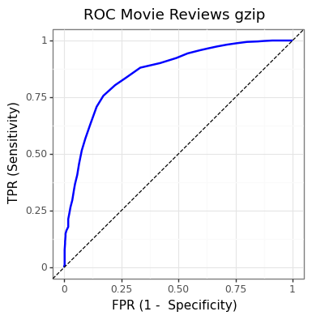

# Movie reviews sentiment analysis

## Nearest neighbors using compression (gzip) based similarity

[*Zhiying Jiang, Matthew Yang, Mikhail Tsirlin, Raphael Tang, Yiqin Dai, and Jimmy Lin. 2023. “Low-Resource” Text Classification: A Parameter-Free Classification Method with Compressors. In Findings of the Association for Computational Linguistics: ACL 2023, pages 6810–6828, Toronto, Canada. Association for Computational Linguistics.*](http://dx.doi.org/10.18653/v1/2023.findings-acl.426)


```python
import numpy as np
import pandas as pd
from plotnine import *
import gzip
import nltk
from nltk.corpus import movie_reviews
from sklearn.model_selection import train_test_split
from sklearn.metrics import (roc_curve, roc_auc_score)
```


```python
# nltk.download('movie_reviews')
```


```python
reviews = [movie_reviews.raw(txt) for txt in movie_reviews.fileids()]
```


```python
polarities = [int(movie_reviews.categories(id)[0] == "pos") for id in movie_reviews.fileids()]
```


```python
db = pd.DataFrame({"txt": reviews, "y": polarities})
```


```python
trn, tst = train_test_split(db, test_size = 0.5, random_state = 42)
```


```python
C2 = [len(gzip.compress(x2.encode())) for x2 in trn.txt]
```


```python
dist = []
for x1 in tst.txt:
    c1 = len(gzip.compress(x1.encode()))
    distance_from_x1 = []
    for x2, c2 in zip(trn.txt, C2):
        c12 = len(gzip.compress((x1 + " " + x2).encode()))
        ncd = (c12 - min(c1, c2)) / max(c1, c2)
        distance_from_x1.append(ncd)
    dist.append(distance_from_x1)
```


```python
k = 147
```


```python
pr_ncd = [trn.y.iloc[np.argsort(d)[:k].tolist()].mean() for d in dist]
```


```python
fpr, tpr, threshold = roc_curve(tst.y, pr_ncd)
```


```python
theme_set(theme_bw());
```


```python
(ggplot() +
     geom_line(aes(x = fpr, y = tpr), color = "blue", size = 1) +
     geom_abline(linetype = "dashed") +
     labs(x = "FPR (1 -  Specificity)", y = "TPR (Sensitivity)", title = "ROC Movie Reviews gzip") +
     theme(figure_size = (4, 4)))
```


    

    


    <ggplot: (116900594348)>


```python
print(f"AUC = {roc_auc_score(tst.y, pr_ncd):.3f}")
```

    AUC = 0.858
    
